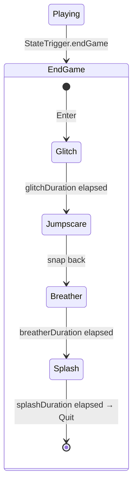

# Endgame Sequence — Full Architecture Plan

## Overview

When the player hits an endgame trigger, the game flows through a multi-phase sequence before quitting. This plan covers the **architecture and phasing** — not implementation code yet.

### Sequence Flow



| Phase | Duration | Player Control | What Happens |
|---|---|---|---|
| **Glitch** | ~X sec | ❌ Frozen, cursor shown | Fake "Not Responding" dialog, screen effects (UI overlays), audio distortion/mute, camera frozen |
| **Jumpscare** | Brief | ❌ Frozen | Custom image fades in via 0→1 intensity, audio distortion stinger |
| **Breather** | ~Y sec | ✅ Restored | Normal gameplay resumes, optional clue object revealed |
| **Splash** | ~Z sec | ❌ None | Black screen + Distant Lighthouse logo, end stinger audio |

> [!IMPORTANT]
> **Pause is blocked** during the entire endgame. The player cannot hit Escape to pause once the sequence starts. Pause Menu "Quit" remains an instant quit — the endgame sequence is a narrative event, not a UI flow.

---

## Architecture Decision: Sub-Sequencer, Not Sub-State Machine

We add **one** new state (`EndGameState`) to the main state machine. The phases within are driven by a simple `enum` + coroutine inside a single `EndGameController` MonoBehaviour — no second state machine class.

### Main State Machine (existing + 1 new state)

```
EnterState → PlayingState ⇄ PausedState
                 ↓
           EndGameState (terminal — no transitions out)
```

### EndGame Sub-Phases (coroutine-driven)

```
Glitch → Jumpscare → Breather → Splash → Quit
```

---

## Existing Systems We Leverage

| Need | Existing System | How |
|---|---|---|
| Freeze player input + show cursor | [AKDisableManager](file:///home/tory/Documents/Code/unity/HorrorHouse/Assets/Scripts/Adventure Puzzle Kit v1.7.1/Core/AKDisableManager.cs) | [DisablePlayerDefault(true, ...)](file:///home/tory/Documents/Code/unity/HorrorHouse/Assets/Scripts/Adventure%20Puzzle%20Kit%20v1.7.1/Core/AKDisableManager.cs#58-81) — already handles cursor, camera, FPS controller |
| Fade/stop audio | [AKAudioManager](file:///home/tory/Documents/Code/unity/HorrorHouse/Assets/Scripts/Adventure Puzzle Kit v1.7.1/Core/AKAudioManager.cs) | [FadeOut()](file:///home/tory/Documents/Code/unity/HorrorHouse/Assets/Scripts/Adventure%20Puzzle%20Kit%20v1.7.1/Core/AKAudioManager.cs#171-193), [StopAll()](file:///home/tory/Documents/Code/unity/HorrorHouse/Assets/Scripts/Adventure%20Puzzle%20Kit%20v1.7.1/Core/AKAudioManager.cs#137-148), [Play()](file:///home/tory/Documents/Code/unity/HorrorHouse/Assets/Scripts/Adventure%20Puzzle%20Kit%20v1.7.1/Core/AKAudioManager.cs#76-93) for stinger |
| Endgame trigger collider | [PlayerTriggerEvent](file:///home/tory/Documents/Code/unity/HorrorHouse/Assets/Scripts/SceneManagement/PlayerTriggerEvent.cs) | Wire `OnPlayerTrigger` → `EndGameController.StartEndGame()` in Inspector |
| Quit application | [SceneManager](file:///home/tory/Documents/Code/unity/HorrorHouse/Assets/Scripts/SceneManagement/SceneManager.cs) | [EndGame()](file:///home/tory/Documents/Code/unity/HorrorHouse/Assets/Scripts/SceneManagement/SceneManager.cs#17-25) |
| Block pause state | [GameState](file:///home/tory/Documents/Code/unity/HorrorHouse/Assets/Scripts/Adventure Puzzle Kit v1.7.1/Core/GameState.cs) | New `IsEndGame` flag checked in `GameStateControllerBehaviour.Update()` |

---

## New Code Summary

### 1. State Machine Changes

#### [MODIFY] [GameStateController.cs](file:///home/tory/Documents/Code/unity/HorrorHouse/Assets/Scripts/SceneManagement/GameState/GameStateController.cs)
- Add `endGame` to `StateTrigger` enum
- Add `EndGameState` class (terminal — returns `null` for all triggers)
- `PlayingState.HandleTrigger` gains `case StateTrigger.endGame → endGameState`
- [StateController](file:///home/tory/Documents/Code/unity/HorrorHouse/Assets/Scripts/SceneManagement/GameState/GameStateController.cs#10-69) instantiates and exposes `endGameState`

#### [MODIFY] [GameStateControllerBehaviour.cs](file:///home/tory/Documents/Code/unity/HorrorHouse/Assets/Scripts/SceneManagement/GameState/GameStateControllerBehaviour.cs)
- Add `TriggerEndGame()` public method
- Guard [Update()](file:///home/tory/Documents/Code/unity/HorrorHouse/Assets/Scripts/Adventure%20Puzzle%20Kit%20v1.7.1/Triggers/AKMasterTrigger.cs#54-59) Escape key: skip if `GameState.IsEndGame`
- Subscribe `endGameState.notifyListenersEnter` → `GameState.EnterEndGame()`

#### [MODIFY] [GameState.cs](file:///home/tory/Documents/Code/unity/HorrorHouse/Assets/Scripts/Adventure Puzzle Kit v1.7.1/Core/GameState.cs)
- Add `IsEndGame` property, `EndGameStarted` event, `EnterEndGame()` method
- Wire `IsEndGame` into `IsPlayerBusy` / `IsInteracting`

---

### 2. EndGame Controller (the main new file)

#### [NEW] [EndGameController.cs](file:///home/tory/Documents/Code/unity/HorrorHouse/Assets/Scripts/SceneManagement/GameState/EndGameController.cs)

A single MonoBehaviour that orchestrates the entire endgame via coroutine.

```csharp
public enum EndGamePhase { Inactive, Glitch, Jumpscare, Breather, Splash }
```

**SerializeField configuration:**

| Field | Type | Purpose |
|---|---|---|
| `glitchDuration` | `float` | How long the glitch/not-responding phase lasts |
| `jumpscareRampDuration` | `float` | How long the jumpscare image ramps from 0→1 intensity |
| `breatherDuration` | `float` | How long the player gets control back |
| `splashDuration` | `float` | How long the logo displays before quit |
| `glitchOverlayUI` | `GameObject` | "Not Responding" panel + screen effect overlays (Raw Images) |
| `jumpscareImage` | `CanvasGroup` or `RawImage` | Image whose alpha is driven 0→1 from script |
| `splashPanel` | `GameObject` | Distant Lighthouse logo panel |
| `clueObject` | `GameObject` | Optional object to activate during breather |
| `endStinger` | [Sound](file:///home/tory/Documents/Code/unity/HorrorHouse/Assets/Scripts/Adventure%20Puzzle%20Kit%20v1.7.1/ScriptableObjects/Sound.cs#27-56) | Audio for the splash screen |
| `sceneManager` | [SceneManager](file:///home/tory/Documents/Code/unity/HorrorHouse/Assets/Scripts/SceneManagement/SceneManager.cs#3-26) | For [EndGame()](file:///home/tory/Documents/Code/unity/HorrorHouse/Assets/Scripts/SceneManagement/SceneManager.cs#17-25) |

**Coroutine flow:**
1. **Glitch**: disable player ([AKDisableManager](file:///home/tory/Documents/Code/unity/HorrorHouse/Assets/Scripts/Adventure%20Puzzle%20Kit%20v1.7.1/Core/AKDisableManager.cs#6-139)), show cursor, activate `glitchOverlayUI`, stop/distort audio → wait `glitchDuration`
2. **Jumpscare**: ramp `jumpscareImage` alpha from 0→1 over `jumpscareRampDuration`, play distortion stinger
3. **Breather**: deactivate overlays, re-enable player, activate `clueObject` → wait `breatherDuration`
4. **Splash**: disable player, activate `splashPanel`, play `endStinger` → wait `splashDuration`
5. Call `sceneManager.EndGame()`

> [!NOTE]
> **All visual effects are UI-based** — Raw Image overlays with animated materials on a full-screen Canvas. The `EndGameController` activates/deactivates GameObjects and drives a 0→1 float on the jumpscare image. The actual look (RGB split, scanlines, static noise, flicker) is authored on the UI materials in Unity — no custom shaders needed in code.
>
> This means you can iterate on the visual look entirely in the editor without touching game logic.

---

## Phased Implementation Order

Each phase is independently testable:

### Phase 1: End Screen Splash (proves the pipeline)
- Add `EndGameState` + `StateTrigger.endGame` to state machine
- Add `GameState.IsEndGame` + pause blocking
- Create `EndGameController` with **only the Splash phase** active
- Wire a [PlayerTriggerEvent](file:///home/tory/Documents/Code/unity/HorrorHouse/Assets/Scripts/SceneManagement/PlayerTriggerEvent.cs#4-19) in the scene to test
- **Result**: Walk into trigger → logo → quit ✅

### Phase 2: Glitch + Jumpscare Phase
- Add Glitch + Jumpscare phases to `EndGameController` coroutine
- Create "Not Responding" UI panel (fourth-wall-breaking fake dialog, cursor visible)
- Add jumpscare image with 0→1 intensity ramp driven from script
- Audio: `AKAudioManager.FadeOut()` during glitch, distortion stinger on jumpscare
- **Result**: Walk into trigger → glitch + fake dialog → jumpscare → logo → quit ✅

### Phase 3: Breather Phase + Clue
- Add the Breather phase between Jumpscare and Splash
- Activate optional clue object during breather
- Re-enable player controls briefly
- **Result**: Full sequence end-to-end ✅

### Phase 4: Visual Polish
- Build glitch overlay textures/materials (scanlines, static, RGB offset as Raw Image layers)
- Fine-tune jumpscare ramp curve
- Audio warping effects during glitch
- Screen flicker timing (rapid enable/disable of overlay layers)
