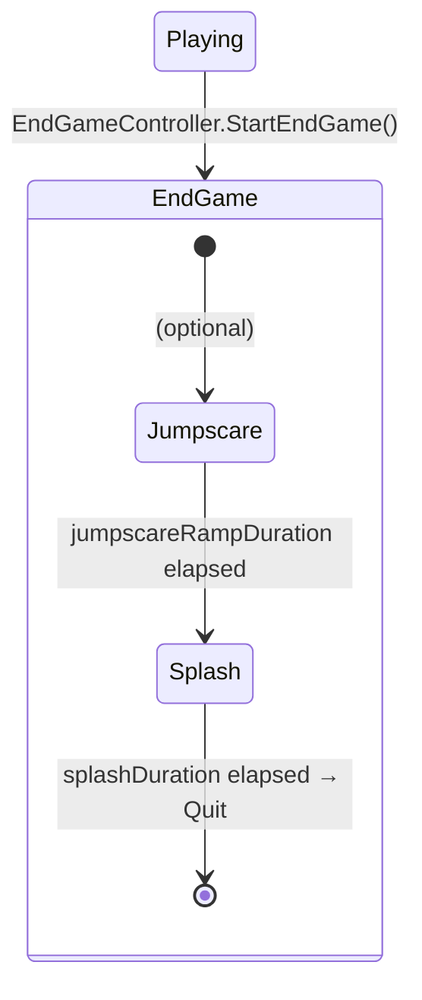

# Endgame Sequence — MVP-First Plan (1 Day)

## Overview

When the player hits an endgame trigger, the game flows through a short sequence before quitting. This plan focuses on **a 1-day shippable MVP** first, with optional stretch phases.

## Scope Guardrails (1 day)

**MUST ship**
- Trigger → lock controls → show end splash → quit
- Block pause (Escape) once the endgame starts (no new menus/states)

**NICE if time remains**
- Jumpscare image fade-in before the splash
- Audio “distortion” by driving an existing filter/mixer parameter on the *currently playing music*

**STRETCH (easy to cut)**
- Glitch “Not Responding” UI + flicker/static polish
- Breather phase (restore control briefly) + optional clue object
  

### Sequence Flow



| Phase | Duration | Player Control | What Happens |
|---|---|---|---|
| **Jumpscare** (nice) | ~0.2–1.0s | ❌ Frozen | Image fades in via 0→1 intensity |
| **Splash** (must) | ~1–5s | ❌ Frozen | Black screen + Distant Lighthouse logo + end stinger audio |
| **Glitch** (stretch) | ~X sec | ❌ Frozen, cursor shown | Fake “Not Responding” dialog + UI overlays + music distortion |
| **Breather** (stretch) | ~Y sec | ✅ Restored | Normal gameplay resumes briefly, optional clue revealed |

> [!IMPORTANT]
> **Pause is blocked** during the entire endgame. The player cannot hit Escape to pause once the sequence starts. Pause Menu "Quit" remains an instant quit — the endgame sequence is a narrative event, not a UI flow.

---

## Architecture Decision: One Sequencer Script (No New Main State for MVP)

For the 1-day MVP, do **not** add a new state to the main state machine. Keep it simple:
- A single `EndGameController` MonoBehaviour drives the phases with an `enum` + coroutine.
- A single flag (ex: `GameState.IsEndGame`) blocks Escape-to-pause while the sequence runs.

### Main State Machine (unchanged for MVP)

```
EnterState → PlayingState ⇄ PausedState
```

### EndGame Sub-Phases (coroutine-driven)

```
(Optional) Glitch → (Optional) Jumpscare → (Optional) Breather → Splash → Quit
```

---

## Existing Systems We Leverage

| Need | Existing System | How |
|---|---|---|
| Freeze player input + show cursor | [AKDisableManager](file:///home/tory/Documents/Code/unity/HorrorHouse/Assets/Scripts/Adventure Puzzle Kit v1.7.1/Core/AKDisableManager.cs) | [DisablePlayerDefault(true, ...)](file:///home/tory/Documents/Code/unity/HorrorHouse/Assets/Scripts/Adventure%20Puzzle%20Kit%20v1.7.1/Core/AKDisableManager.cs#58-81) — already handles cursor, camera, FPS controller |
| End stinger SFX | [AKAudioManager](file:///home/tory/Documents/Code/unity/HorrorHouse/Assets/Scripts/Adventure Puzzle Kit v1.7.1/Core/AKAudioManager.cs) | [Play(Sound)](file:///home/tory/Documents/Code/unity/HorrorHouse/Assets/Scripts/Adventure%20Puzzle%20Kit%20v1.7.1/Core/AKAudioManager.cs#64-100) for the end stinger |
| Music distortion | Existing music GameObject | Reference the music object (ex: `AudioSource`) and adjust an attached `AudioDistortionFilter` (or an exposed `AudioMixer` float) during Glitch; reset on exit |
| Endgame trigger collider | [PlayerTriggerEvent](file:///home/tory/Documents/Code/unity/HorrorHouse/Assets/Scripts/SceneManagement/PlayerTriggerEvent.cs) | Wire `OnPlayerTrigger` → `EndGameController.StartEndGame()` in Inspector |
| Quit application | [SceneManager](file:///home/tory/Documents/Code/unity/HorrorHouse/Assets/Scripts/SceneManagement/SceneManager.cs) | [EndGame()](file:///home/tory/Documents/Code/unity/HorrorHouse/Assets/Scripts/SceneManagement/SceneManager.cs#17-25) |
| Block pause input | [GameStateControllerBehaviour](file:///home/tory/Documents/Code/unity/HorrorHouse/Assets/Scripts/SceneManagement/GameState/GameStateControllerBehaviour.cs) | Guard Escape in `Update()` when endgame is active |

---

## New Code Summary

### 1. MVP: Pause Block Flag (small + safe)

#### [MODIFY] [GameStateControllerBehaviour.cs](file:///home/tory/Documents/Code/unity/HorrorHouse/Assets/Scripts/SceneManagement/GameState/GameStateControllerBehaviour.cs)
- Guard `Update()` Escape key: ignore if endgame is active (so the pause menu can’t interrupt the sequence)

#### [MODIFY] [GameState.cs](file:///home/tory/Documents/Code/unity/HorrorHouse/Assets/Scripts/Adventure Puzzle Kit v1.7.1/Core/GameState.cs)
- Add `IsEndGame` property and a simple `EnterEndGame()` setter (optionally also fold it into `IsPlayerBusy` / `IsInteracting` if needed)

---

### 2. EndGame Controller (the main new file)

#### [NEW] [EndGameController.cs](file:///home/tory/Documents/Code/unity/HorrorHouse/Assets/Scripts/SceneManagement/GameState/EndGameController.cs)

A single MonoBehaviour that orchestrates the entire endgame via coroutine.

```csharp
public enum EndGamePhase { Inactive, Glitch, Jumpscare, Breather, Splash }
```

**SerializeField configuration:**

| Field | Type | Purpose |
|---|---|---|
| `glitchDuration` | `float` | How long the glitch/not-responding phase lasts |
| `jumpscareRampDuration` | `float` | How long the jumpscare image ramps from 0→1 intensity |
| `breatherDuration` | `float` | How long the player gets control back |
| `splashDuration` | `float` | How long the logo displays before quit |
| `glitchOverlayUI` | `GameObject` | "Not Responding" panel + screen effect overlays (Raw Images) |
| `jumpscareImage` | `CanvasGroup` or `RawImage` | Image whose alpha is driven 0→1 from script |
| `splashPanel` | `GameObject` | Distant Lighthouse logo panel |
| `clueObject` | `GameObject` | Optional object to activate during breather |
| `musicDistortion` | `AudioDistortionFilter` or mixer ref | Reference the *existing music* filter/mixer parameter and drive it during Glitch (stretch) |
| `endStinger` | [Sound](file:///home/tory/Documents/Code/unity/HorrorHouse/Assets/Scripts/Adventure%20Puzzle%20Kit%20v1.7.1/ScriptableObjects/Sound.cs#27-56) | Audio for the splash screen |
| `sceneManager` | [SceneManager](file:///home/tory/Documents/Code/unity/HorrorHouse/Assets/Scripts/SceneManagement/SceneManager.cs#3-26) | For [EndGame()](file:///home/tory/Documents/Code/unity/HorrorHouse/Assets/Scripts/SceneManagement/SceneManager.cs#17-25) |

**Coroutine flow:**
1. **(Optional) Glitch**: disable player, show cursor, activate `glitchOverlayUI`, drive `musicDistortion` → wait `glitchDuration`
2. **(Optional) Jumpscare**: ramp `jumpscareImage` alpha from 0→1 over `jumpscareRampDuration`
3. **(Optional) Breather**: deactivate overlays, re-enable player, activate `clueObject` → wait `breatherDuration`
4. **Splash (MVP)**: disable player, activate `splashPanel`, play `endStinger` → wait `splashDuration`
5. Quit via `sceneManager.EndGame()`

> [!NOTE]
> **All visual effects are UI-based** — Raw Image overlays with animated materials on a full-screen Canvas. The `EndGameController` activates/deactivates GameObjects and drives a 0→1 float on the jumpscare image. The actual look (RGB split, scanlines, static noise, flicker) is authored on the UI materials in Unity — no custom shaders needed in code.
>
> This means you can iterate on the visual look entirely in the editor without touching game logic.

---

## Phased Implementation Order

Each phase is independently testable:

### Phase 1 (MVP): End Screen Splash (proves the pipeline)
- Add `GameState.IsEndGame` (or equivalent) + pause blocking
- Create `EndGameController` with **only the Splash phase** active
- Wire a [PlayerTriggerEvent](file:///home/tory/Documents/Code/unity/HorrorHouse/Assets/Scripts/SceneManagement/PlayerTriggerEvent.cs#4-19) in the scene to test
- **Result**: Walk into trigger → logo → quit ✅

### Phase 2 (Nice): Jumpscare Phase
- Add Jumpscare phase to `EndGameController` coroutine
- Add jumpscare image with 0→1 intensity ramp driven from script
- **Result**: Walk into trigger → jumpscare → logo → quit ✅

### Phase 3 (Stretch): Glitch Phase + Music Distortion
- Create “Not Responding” UI panel + overlays (cursor visible)
- Reference the music object and drive its existing distortion filter/mixer parameter during glitch
- **Result**: Walk into trigger → glitch → jumpscare → logo → quit ✅

### Phase 4 (Stretch): Breather Phase + Clue
- Add the Breather phase between Jumpscare and Splash
- Activate optional clue object during breather
- Re-enable player controls briefly
- **Result**: Full sequence end-to-end ✅

### Phase 5 (Stretch): Visual Polish
- Build glitch overlay textures/materials (scanlines, static, RGB offset as Raw Image layers)
- Fine-tune jumpscare ramp curve
- Screen flicker timing (rapid enable/disable of overlay layers)

---

## Deferred / Optional: EndGame Main State

If you later want `StateTrigger.endGame` + `EndGameState`, avoid a “return `null` for all triggers” terminal state.
In this project, `StateController.HandleTrigger(...)` logs an error when a state returns `null` (no transition). A terminal endgame state should **swallow triggers** (return itself) or the controller should be updated to treat endgame as a valid terminal condition.
