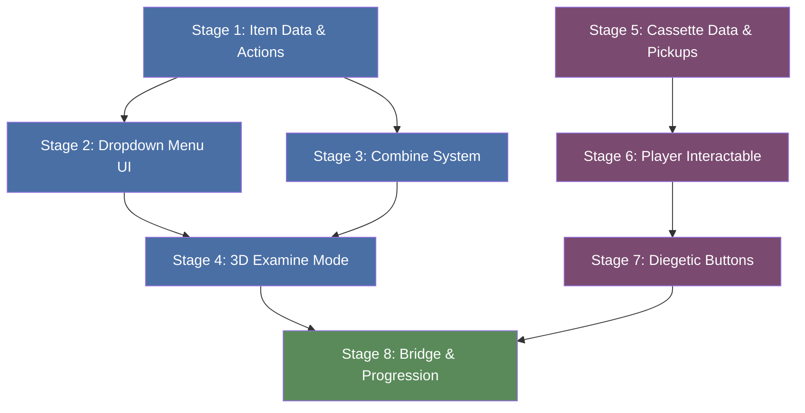

# Multistage Implementation Plan: Inventory Overhaul → Cassette Player

A staged rollout plan that builds the **Inventory Overhaul** first (since the cassette system depends on it), then layers the **Cassette Player Mechanic** on top.

---

## Stage 1 — Inventory Data & Action Foundation

> **Goal**: Extend item definitions so every item knows its own actions.

- [ ] Extend existing item data (or create new SO) with `itemId`, `displayName`, `icon`, `itemPrefab` (for 3D examine), and an `actions` list
- [ ] Define `ItemAction` structure: `ActionType` enum (`Use`, `Combine`, `Examine`, `Custom`), `label`, `requiredContext`, `customHandlerId`
- [ ] **Examine/View is a default action on every item** — it should always appear in the action list even if not explicitly configured
- [ ] Create an `InventoryActionRouter` that maps action selection → handler with safe fallbacks for missing handlers

**Source docs:** [InventoryOverhaul.md](file:///home/tory/Documents/Code/unity/HorrorHouse/Assets/Plans/InventoryOverhaul.md) §5, [inventory-overhaul plan](file:///home/tory/Documents/Code/unity/HorrorHouse/Assets/Plans/inventory-overhaul_0a41f2e2.plan.md) `inventory-data` + `action-router`

---

## Stage 2 — Dropdown Action Menu UI

> **Goal**: Give the player a Resident Evil–style contextual menu per inventory item.

- [ ] Implement dropdown menu that appears next to highlighted item slot
- [ ] Support keyboard/controller + mouse navigation (Select / Back / Combine)
- [ ] Align prompt text and styling with `AKUIManager` conventions
- [ ] Keep menu compact: 3–5 actions per item

**Source docs:** [InventoryOverhaul.md](file:///home/tory/Documents/Code/unity/HorrorHouse/Assets/Plans/InventoryOverhaul.md) §6, [inventory-overhaul plan](file:///home/tory/Documents/Code/unity/HorrorHouse/Assets/Plans/inventory-overhaul_0a41f2e2.plan.md) `action-menu-ui`

---

## Stage 3 — Combine System

> **Goal**: Let the player combine two inventory items using data-driven recipes.

- [ ] Create `CombineRecipe` ScriptableObject database (`inputA`, `inputB`, `resultItemId`, `consumeInputs`, `resultState`)
- [ ] Implement combine selection flow: choose first item → "Combine" → choose second item → validate
- [ ] Add rejection messaging for invalid combines ("That won't work")
- [ ] Ensure selection state is preserved after rejection

**Source docs:** [InventoryOverhaul.md](file:///home/tory/Documents/Code/unity/HorrorHouse/Assets/Plans/InventoryOverhaul.md) §5.3 + §9, [inventory-overhaul plan](file:///home/tory/Documents/Code/unity/HorrorHouse/Assets/Plans/inventory-overhaul_0a41f2e2.plan.md) `combine-recipes` + `ux-feedback`

---

## Stage 4 — 3D Examine / Inspect Mode

> **Goal**: Give **every** inventory item a viewer/examine option via the 3D inspect system.

- [ ] **Every item gets an "Examine" action by default** — the viewer is universal, not opt-in
- [ ] Hook inventory item's `itemPrefab` to spawn in the 3D viewer on "Examine"
- [ ] Items without a custom `itemPrefab`: auto-generate a viewer using the item's icon/sprite or a generic pedestal display
- [ ] Allow item-specific buttons inside examine mode (driven by the item's action list)
- [ ] Return to inventory menu with selection preserved on exit
- [ ] Commit item state changes explicitly on viewer exit to prevent state leakage

**Source docs:** [InventoryOverhaul.md](file:///home/tory/Documents/Code/unity/HorrorHouse/Assets/Plans/InventoryOverhaul.md) §4.2 + §9.1, [inventory-overhaul plan](file:///home/tory/Documents/Code/unity/HorrorHouse/Assets/Plans/inventory-overhaul_0a41f2e2.plan.md) `examine-viewer`

---

## Stage 5 — Cassette Data & Pickup Items

> **Goal**: Create the data layer and world pickups for cassette tapes.

- [ ] Create `CassetteData` ScriptableObject: `cassetteId`, `audioClip`, `displayName`, `subtitleKey?`, `isCritical?`
- [ ] Make cassette pickup items as standard `AKItem` interactables referencing a `CassetteData` asset
- [ ] Inventory should be able to query by `cassetteId`

**Source docs:** [CassettePlayer.md](file:///home/tory/Documents/Code/unity/HorrorHouse/Assets/Plans/CassettePlayer.md) §3, [cassette-player plan](file:///home/tory/Documents/Code/unity/HorrorHouse/Assets/Plans/cassette-player-mechanic_0dbbb989.plan.md) `cassette-data` + `cassette-item`

---

## Stage 6 — Cassette Player Interactable

> **Goal**: Build the world-space cassette player with state machine and audio playback.

- [ ] Create `CassettePlayerInteractable` implementing `IInteractable`, wired via `AKItem`/`SystemType`
- [ ] Implement state machine: `Idle` → `TapeInserted` → `Playing` → `Stopped` → `Idle`
- [ ] Audio playback: set clip from `CassetteData`, play/stop/rewind controls
- [ ] Tape insertion flow (keycard-style): check inventory for cassette, consume/flag, update visual state
- [ ] Tape ejection: return to inventory or respawn pickup
- [ ] Optional: `requiresSpecificCassette` + accepted IDs list

**Source docs:** [CassettePlayer.md](file:///home/tory/Documents/Code/unity/HorrorHouse/Assets/Plans/CassettePlayer.md) §4 + §6, [cassette-player plan](file:///home/tory/Documents/Code/unity/HorrorHouse/Assets/Plans/cassette-player-mechanic_0dbbb989.plan.md) `cassette-player-interactable`

---

## Stage 7 — Diegetic Button Controls

> **Goal**: Make the physical buttons on the cassette player model clickable.

- [ ] Add child colliders on model: `PlayButton`, `StopButton`, `EjectButton`, `RewindButton`
- [ ] Create `CassetteButton` helper component with `ButtonType` enum
- [ ] Map `AKInteractor` raycast hits → specific button → dispatch to player interactable methods
- [ ] Keep interaction text minimal/diegetic ("Use Player")

**Source docs:** [CassettePlayer.md](file:///home/tory/Documents/Code/unity/HorrorHouse/Assets/Plans/CassettePlayer.md) §5, [cassette-player plan](file:///home/tory/Documents/Code/unity/HorrorHouse/Assets/Plans/cassette-player-mechanic_0dbbb989.plan.md) `cassette-buttons`

---

## Stage 8 — Cassette ↔ Inventory Bridge & Progression

> **Goal**: Connect the cassette examine actions to the player system; hook story events.

- [ ] Add cassette action bridge so tape "Play/Stop/Eject" in examine mode calls `CassettePlayerInteractable` (or shows "No Player" if unavailable)
- [ ] Expose `OnTapeInserted`, `OnTapeEjected`, `OnTapePlay`, `OnTapeStop`, `OnTapeFinished` as UnityEvents
- [ ] Wire at least one audiolog into the current scene as a vertical slice (story flags, door unlock, etc.)
- [ ] Visual feedback hooks: button depress animation, LED indicator

**Source docs:** [inventory-overhaul plan](file:///home/tory/Documents/Code/unity/HorrorHouse/Assets/Plans/inventory-overhaul_0a41f2e2.plan.md) `cassette-bridge`, [CassettePlayer.md](file:///home/tory/Documents/Code/unity/HorrorHouse/Assets/Plans/CassettePlayer.md) §7 + §9, [cassette-player plan](file:///home/tory/Documents/Code/unity/HorrorHouse/Assets/Plans/cassette-player-mechanic_0dbbb989.plan.md) `cassette-progression`

---

## Edge Cases (all stages)

Captured across both systems:

| Scenario | Handling |
|---|---|
| Play/Rewind with no tape | Ignore or play error SFX |
| Rewind while playing | Stop + reset |
| Eject while playing | Stop + eject |
| Wrong tape in restricted player | Reject feedback |
| Combine with invalid item | "Not combinable" → return to menu |
| Examine without custom prefab | Auto-generate viewer from icon/sprite or generic pedestal |
| Use item in wrong context | Feedback, don't consume |
| Custom action with missing handler | Log warning, no-op |
| State leakage on examine exit | Explicit "apply state" commit step |

---

## Dependency Graph

> 🟦 = Inventory Overhaul stages &nbsp;&nbsp; 🟪 = Cassette Player stages &nbsp;&nbsp; 🟩 = Integration stage

**Parallelism note:** Stages 5–7 (cassette) can be developed in parallel with Stages 2–4 (inventory) once Stage 1 is complete, since they only converge at Stage 8.
